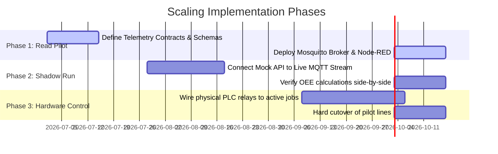

# Smart MES: Enterprise IoT & Scalability Roadmap
> **Architectural blueprint for transitioning from local kiosk simulation to real-world machine integration and high-scale factory environments.**

---

## 1. High-Level Enterprise Architecture

To connect real-world machines (PLCs, CNC controllers, sensors) while maintaining high availability, low latency, and modularity, the architecture is split into five distinct layers.

```mermaid
graph TD
    %% Edge Layer
    subgraph Edge Layer (On-Premises)
        A[CNC / PLC Controllers] -->|OPC UA / Modbus| B[Edge Gateway: Node-RED / Kepware]
        B -->|Encrypted MQTT / Sparkplug B| C[On-Site Edge Broker]
    end

    %% Streaming Layer
    subgraph Data Pipeline & Streaming
        C -->|Bridge / WAN| D[Enterprise Message Broker: EMQX / Apache Kafka]
    end

    %% Services Layer
    subgraph Backend Microservices
        D -->|Kafka Consumer / MQTT Client| E[IoT Ingestion Worker]
        E -->|Publish Status/OEE| F[FastAPI WebSockets / API]
        G[Celery Background Tasks] <--> F
    end

    %% Storage Layer
    subgraph Storage & Cache
        E -->|Transactional Log| H[(PostgreSQL DB)]
        E -->|Raw Telemetry Time-Series| I[(Historian: TimescaleDB / InfluxDB)]
        F <-->|Live Cache & Sessions| J[(Redis Cache)]
    end

    %% Presentation Layer
    subgraph Presentation Layer
        F -->|Real-Time WebSockets| K[Operator Kiosk UI]
        F -->|REST APIs| L[Supervisor Dashboard SCADA]
    end

    style B fill:#3b82f6,stroke:#1d4ed8,color:#fff
    style D fill:#10b981,stroke:#047857,color:#fff
    style E fill:#8b5cf6,stroke:#6d28d9,color:#fff
    style I fill:#f59e0b,stroke:#b45309,color:#fff
```

---

## 2. Ingestion & Event Workflow

Below is the step-by-step data path detailing how a physical machine event updates the MES software in real-time.

```mermaid
sequenceDiagram
    autonumber
    participant Machine as Physical PLC / Sensor
    participant Gateway as Edge Gateway (Node-RED)
    participant Broker as MQTT/Kafka Broker
    participant Worker as FastAPI IoT Worker
    participant DB as PostgreSQL / TimescaleDB
    participant UI as React UI (Dashboard / Kiosk)

    Note over Machine,UI: Scenario: Machine completes 1 part & updates status
    Machine->>Gateway: Increment pulse (DI Pin or Modbus Register)
    Gateway->>Broker: Publish: factory/line1/machine_a/count {"pulse": 1, "timestamp": "12:00:00.123"}
    Broker->>Worker: Consume message from topic
    
    rect rgb(30, 41, 59)
        Note over Worker,DB: Process Count & Update Database
        Worker->>DB: Increment units_produced for active_job in 'jobs'
        Worker->>DB: Insert record to 'productions' & calculate OEE
        Worker->>DB: Log raw timestamp to Time-Series Historian (TimescaleDB)
    end

    Worker->>UI: Broadcast real-time update (WebSocket: machine_state_update)
    Note over UI: UI updates progress bar, parts counter & OEE dials in 50ms
```



---

## 3. Storage Strategy: Transactional vs. Historian

In an enterprise environment, raw machine data is generated at high frequencies (e.g., sensor readings every 100ms). Storing this directly in PostgreSQL will lead to performance degradation. We split the database strategy:

| Database Type | Target Engine | Purpose | Example Data |
| :--- | :--- | :--- | :--- |
| **Transactional (RDBMS)** | PostgreSQL | Core business models, user access control, active jobs, OEE aggregates, and system configurations. | User credentials, Job specs, active machine state, completed logs. |
| **Historian (Time-Series)** | TimescaleDB / InfluxDB | Storing high-velocity raw telemetry for historical charting and machine health analysis. | Raw spindle speeds, temperatures, current loads, raw pulse times. |
| **Caching Layer (In-Memory)**| Redis | Storing volatile real-time states to reduce DB read/write pressure. | Live connection heartbeats, temporary cycle timers, user sessions. |

---

## 4. Large-Scale Team Delegation (Execution Blueprint)

For a large development team, the work is divided into specialized tracks to ensure parallel execution:

### 🛠️ Edge & IoT Integration Team (Operational Technology)
* **Responsibilities:** 
  * Configure Edge Gateways (Node-RED, Kepware, or Inductive Automation Ignition).
  * Map PLC registers and physical digital input/output (DIO) pins to software topics.
  * Standardize payloads using **Sparkplug B** (an industrial wrapper for MQTT that provides structured state management).

### ⚙️ Backend & Data Platform Team (IT Backend)
* **Responsibilities:**
  * Build the MQTT/Kafka subscriber workers in FastAPI.
  * Implement Celery/RabbitMQ pipelines for asynchronous aggregations (OEE calculations, shift reports).
  * Design database schemas, partition Postgres time-series tables, and maintain indexing.

### 💻 Frontend & SCADA UX Team (IT Frontend)
* **Responsibilities:**
  * Build WebSockets event consumers inside React state management (Redux / Context API).
  * Design SCADA-style machine layout overlays and high-speed data tables.
  * Implement offline capabilities for kiosks in case local factory Wi-Fi drops temporarily.

### 🛡️ DevOps, SRE & CyberSecurity Team
* **Responsibilities:**
  * Containerize microservices (Docker & Kubernetes) and configure edge cluster deployments.
  * Implement **TLS/SSL Encryption** for all MQTT message brokers.
  * Setup Prometheus/Grafana monitoring dashboards for microservice health.

---

## 5. Rollout Phases (Simulation to Shop Floor)



### Phase 1: Read-Only Pilot (No Risk)
* Deploy MQTT broker on-premise.
* Read data from 1-2 machines.
* Publish raw status changes to the broker and view them in a separate dashboard tab without altering active job configurations.

### Phase 2: Shadow Run (Validation)
* Run the Kiosk page in parallel with actual hardware signals.
* Log discrepancies between what operators click and what PLC state sensors report to tune Edge thresholds.

### Phase 3: Hardware-in-the-Loop Cutover
* Fully connect the production database to the IoT Workers.
* Set the machines to automatically transition status and increment counts directly from PLC relays.
